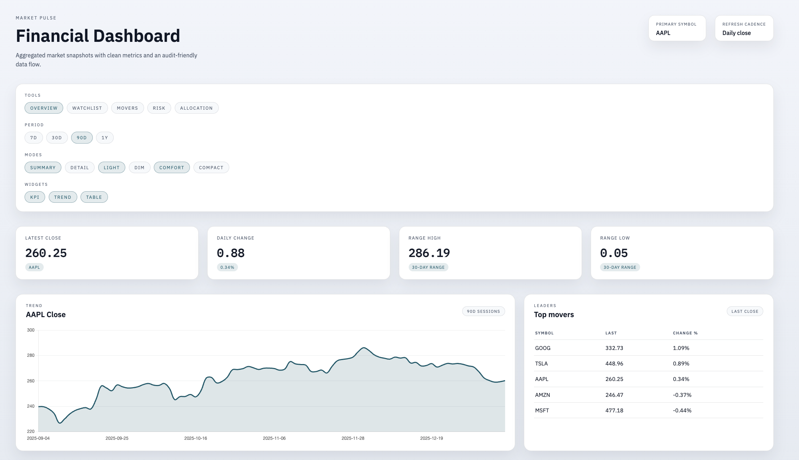
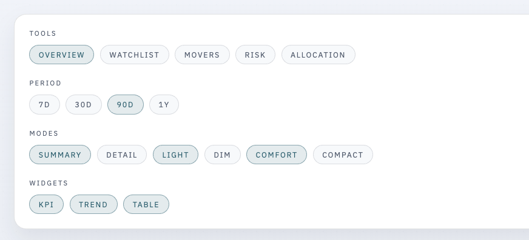
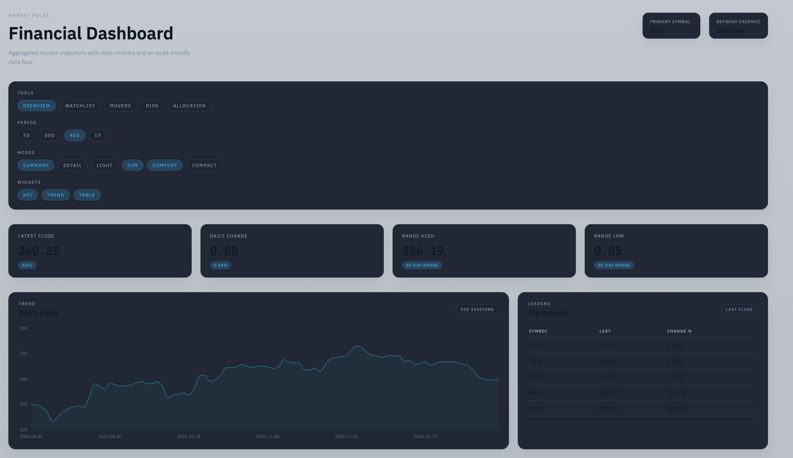

# financial-dashboard

Financial analytics dashboard that aggregates public market data and visualizes KPIs, time series, and top assets. Built to demonstrate clean architecture, clear data contracts, and production-grade documentation.


## What this app does
- Ingests daily close prices from Stooq (no API key required).
- Aggregates metrics in a clean layered backend.
- Presents insights in a strict, analytics-first Angular dashboard.

## Screenshots




## Live demo
- Frontend: https://financial-dashboard-omega-three.vercel.app/
- Backend: https://financial-dashboard-5o14.onrender.com

## Architecture
- Backend: modular monolith with domain/application/infrastructure/interfaces layers.
- Frontend: Angular SPA with a thin API layer and reusable widgets.
- Pipeline: ingestion -> normalization -> aggregation -> presentation.

See `docs/architecture.md` and `docs/adr/` for decisions and diagrams.

## Project structure
```
/
  backend/
    src/
      domain/
      application/
      infrastructure/
      interfaces/
  frontend/
    src/
      api/
      app/
  docs/
    adr/
    assets/
```

## API
- `GET /health`
- `GET /metrics/summary?symbol=aapl`
- `GET /metrics/timeseries?symbol=aapl&points=30`
- `GET /metrics/top-assets?symbols=aapl,msft,amzn`

## Local development
Backend:
```
cd backend
npm install
npm run dev
```

Frontend:
```
cd frontend
npm install
npm start
```

The frontend proxies `/api` to `http://localhost:3000`.

## Testing
Backend:
```
cd backend
npm test
```

Frontend:
```
cd frontend
npm test
```

## Deployment
### Backend (Render)
1) Create a Render account: https://render.com
2) New → Web Service → connect this repo.
3) Configure:
   - Root directory: `backend`
   - Build command: `npm install && npm run build`
   - Start command: `node dist/index.js`
4) Deploy and copy the public URL, e.g. `https://financial-dashboard-5o14.onrender.com`.

### Frontend (Vercel)
1) Create a Vercel account: https://vercel.com
2) New Project → import this repo.
3) Configure:
   - Root directory: repository root
   - Build command: handled by `vercel.json`
   - Output directory: handled by `vercel.json`
4) Ensure `vercel.json` points to your Render URL.
   - Current backend URL: `https://financial-dashboard-5o14.onrender.com`

## Documentation
- `docs/architecture.md`
- `docs/adr/`
- `docs/glossary.md`

## Contribution
- Conventional Commits (e.g. `feat(api): add summary endpoint`).
- Feature branches per task.
- See `CONTRIBUTING.md`.

## License
MIT. See `LICENSE`.
