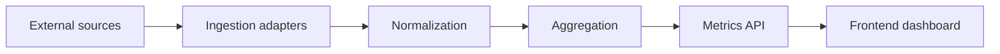

# Architecture

## Overview
The system is split into a backend metrics API and a frontend analytics dashboard. Data flows from ingestion to aggregation and is exposed via stable DTOs for visualization.

## Data flow

## Backend layers
- domain: core entities, value objects, and invariants.
- application: use-cases that orchestrate domain logic.
- infrastructure: integrations, persistence, and external APIs.
- interfaces: HTTP controllers, DTOs, and validation.

## Frontend layers
- api: data fetching and DTO mapping.
- store: state management (thin and explicit).
- components: reusable widgets (cards, charts, tables).
- pages: composition of widgets into views.

## Non-goals (initial)
- Real-time streaming. Polling with cache is enough for v1.
- Complex permissions model. Public read-only dashboard for v1.
